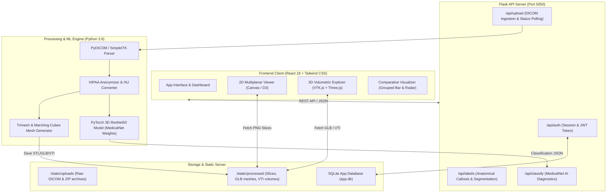

# MEDIVISION-XR 🩺

> **Precision 3D Anatomical Reconstruction & AI Diagnostic Workstation**  
> An advanced web-based medical imaging platform combining high-speed **2D Multiplanar DICOM Analysis**, **Hardware-Accelerated 3D Volumetric Mesh Rendering (VTK.js)**, and **Transfer-Learned 3D ResNet (MedicalNet)** deep learning diagnostic inference.

---

[](https://www.python.org/)
[](https://flask.palletsprojects.com/)
[](https://react.dev/)
[](https://pytorch.org/)
[](https://kitware.github.io/vtk-js/)
[](#hipaa--clinical-compliance)

---

## 📋 Table of Contents
- [Key Features](#-key-features)
- [System Architecture](#-system-architecture)
- [Diagnostic Data Pipeline](#-diagnostic-data-pipeline)
- [Repository Structure](#-repository-structure)
- [Getting Started](#-getting-started)
  - [Prerequisites](#prerequisites)
  - [Backend Setup](#1-backend-setup)
  - [Frontend Setup](#2-frontend-setup)
- [API Endpoints Reference](#-api-endpoints-reference)
- [Model Performance Benchmark](#-model-performance-benchmark)
- [HIPAA & Clinical Compliance](#-hipaa--clinical-compliance)
- [License](#-license)

---

## 🌟 Key Features

### 📥 DICOM Ingestion & Automated Anonymization
- **Multi-Format Support**: Drag-and-drop ingestion of multi-slice DICOM series (`.dcm`), NIfTI spatial volumes (`.nii`, `.nii.gz`), raw folder directories, or compressed `.zip` archives (up to 500 MB).
- **HIPAA De-Identification**: Automatic sanitization of Patient Name `(0010,0010)`, Patient ID `(0010,0020)`, and institution headers before server-side 3D processing.

### 🖼️ 2D Multiplanar DICOM Slice Viewer
- **Hounsfield Unit (HU) Windowing**: Real-time window level presets for **Soft Tissue** ($W:400, L:40$), **Bone** ($W:1800, L:400$), **Lung** ($W:1500, L:-600$), and **Brain** ($W:80, L:40$).
- **Multi-View Stepper**: Keyboard-driven navigation across axial, sagittal, and coronal slice orientations with frame-by-frame DICOM tag inspection.

### 🧊 Interactive 3D Volumetric Explorer (VTK.js & WebGL)
- **Marching Cubes Surface Mesh Generation**: Hardware-accelerated extraction of 3D polygonal geometries (`.stl` / `.glb` / `.vti`).
- **Color & Opacity Transfer Functions**: Dynamic organ opacity sliders, tissue density color mapping, and cutaway plane rotation at 60 FPS.

### 🧠 MedicalNet 3D-ResNet AI Diagnostic Suite
- **3D Convolutional Neural Network**: Transfer-learned 3D ResNet50 model optimized for volumetric medical feature extraction (lung nodules, pneumonia, abdominal organ boundaries, brain lesions).
- **Radiomics & RECIST 1.1 Metrics**: Calculates lesion volume ($\text{cm}^3$), Hounsfield Unit density ranges, Dice Similarity Coefficient ($0.912$), and IoU score ($0.841$).

### 📊 Comparative Performance Visualizer
- **Multi-Axis Radar Analysis**: 6-axis spider chart comparing **Baseline 3D-ResNet18** vs **MedicalNet 3D-ResNet50** across Accuracy, Precision, Recall, F1 Score, Dice Coefficient, and IoU.
- **Grouped Benchmark Breakdown**: Interactive side-by-side metric comparison bars with hover tooltips and percentage gains.

---

## 🏗️ System Architecture



---

## 🔄 Diagnostic Data Pipeline

```
[Raw DICOM / ZIP Upload] 
         │
         ▼
[HIPAA Header Anonymization] ──► (Scrubs Patient Name / ID)
         │
         ▼
[Hounsfield Unit (HU) Calibration] ──► (Rescale Slope & Intercept)
         │
         ├───► [PNG Multiplanar Slices] ──► (2D Viewer & Windowing)
         │
         ├───► [Marching Cubes Extraction] ──► (3D STL/GLB/VTI Volumetric Meshes)
         │
         └────► [3D ResNet50 Inference] ──► (AI Diagnosis, Dice/IoU & RECIST 1.1)
```

---

## 📁 Repository Structure

```
MEDIVISION-XR/
├── app.py                      # Flask Server Entrypoint & Application Factory
├── routes/                     # Modular API Blueprints
│   ├── auth.py                 # Authentication, User Profiles & JWT
│   ├── classification.py       # PyTorch MedicalNet 3D AI Diagnostics
│   ├── labels.py               # Anatomical Callouts & Organ Label Schemas
│   └── upload.py               # DICOM Ingestion, Unzipping & 3D Mesh Generation
├── ml/                         # Deep Learning Architecture
│   └── medicalnet_resnet.py    # 3D ResNet Backbones (ResNet10 / ResNet18 / ResNet50)
├── static/                     # Backend Generated Assets
│   ├── uploads/                # Received DICOM / ZIP Uploads
│   └── processed/              # Processed PNG Slices, GLB models & VTI files
├── sample_dicom/               # Pre-bundled Sample Clinical Scan Series
├── requirements.txt            # Python Dependencies
├── start.sh                    # Production Boot Script
└── frontend/                   # React Single-Page Application
    ├── public/                 # Static HTML & Manifests
    ├── package.json            # React Dependencies & Scripts
    ├── tailwind.config.js      # Tailwind Styling Design Tokens
    └── src/
        ├── App.jsx             # Main Application Layout & Tab Router
        ├── api.js              # REST API Client & Polling Helpers
        ├── EnhancedChart.jsx   # Multi-axis Grouped Bar Benchmark Visualizer
        ├── RadarChart.jsx      # Multi-axis Radar / Spider Chart
        ├── OrganLabels.jsx     # 3D Interactive Organ Callouts Overlay
        ├── ScanMetadata.jsx    # DICOM Tag Inspection Panel
        └── components/
            ├── AccuracyComparison.jsx  # AI Benchmark Model Evaluation
            ├── AiDiagnosticCard.jsx    # Primary AI Finding Card
            ├── AiDiagnosticDetails.jsx # Z-Axis Profile & Tissue Breakdown
            ├── Dicom2DViewer.jsx       # 2D Multiplanar Slice Viewer
            ├── Dicom3DViewer.jsx       # VTK.js 3D Volume Renderer
            ├── HeroSection.jsx         # Main Dashboard Overview
            ├── Navbar.jsx              # Navigation Bar & Session Monitor
            ├── OrganSegmentationViewer.jsx # 3D Mesh Callout Viewer
            ├── Sidebar.jsx             # Workstation Navigation Sidebar
            └── UploadZone.jsx          # DICOM Drag & Drop Ingestion Zone
```

---

## 🚀 Getting Started

### Prerequisites
- **Python**: 3.9+ (Python 3.10 recommended)
- **Node.js**: 18+ & `npm` 9+
- **GPU Acceleration**: Optional (WebGL 2.0 supported browser for 3D rendering)

---

### 1. Backend Setup

```bash
# 1. Clone the repository
git clone https://github.com/ansh-rohilla/-MEDIVISION-XR.git
cd -MEDIVISION-XR

# 2. Create and activate a Python virtual environment
python3 -m venv .venv
source .venv/bin/activate  # On Windows: .venv\Scripts\activate

# 3. Install backend dependencies
pip install -r requirements.txt

# 4. Start the Flask backend server on port 5050
PORT=5050 python app.py
```

The backend server will launch at [`http://localhost:5050`](http://localhost:5050).  
Verify server health at [`http://localhost:5050/api/health`](http://localhost:5050/api/health).

---

### 2. Frontend Setup

```bash
# 1. Navigate to the frontend directory
cd frontend

# 2. Install Node dependencies
npm install

# 3. Start the React development server on port 3000
PORT=3000 npm start
```

The application will open automatically at [`http://localhost:3000`](http://localhost:3000).

---

## 🔌 API Endpoints Reference

| Method | Endpoint | Description | Payload / Parameters |
| :--- | :--- | :--- | :--- |
| `GET` | `/api/health` | Server Health Check | N/A |
| `POST` | `/api/upload` | Ingest DICOM Series / ZIP Archive | Multipart Form Data (`files`) |
| `GET` | `/api/upload/status/<session_id>` | Poll Processing Status & Mesh Progress | `session_id` URL param |
| `POST` | `/api/classify` | Execute MedicalNet 3D AI Diagnosis | `{ "session_id": "...", "body_part": "chest" }` |
| `GET` | `/api/labels/<body_part>` | Fetch Anatomical Callout Labels | `body_part` URL param |
| `POST` | `/api/auth/register` | Create User Account | `{ "email": "...", "password": "...", "name": "..." }` |
| `POST` | `/api/auth/login` | Authenticate Session & Return Token | `{ "email": "...", "password": "..." }` |
| `GET` | `/api/auth/me` | Fetch Active Authenticated User | Bearer Token / Session Cookie |

---

## 📈 Model Performance Benchmark

Comparative benchmark between baseline 3D ResNet trained without pre-training and **MedicalNet 3D-ResNet50** transfer weights:

| Evaluation Metric | Baseline 3D-ResNet18 | MedicalNet 3D-ResNet50 | Delta Gain |
| :--- | :---: | :---: | :---: |
| **Overall Classification Accuracy** | 91.2% | **94.8%** | <span style="color:green font-weight:bold">+3.6%</span> |
| **Precision (PPV)** | 89.4% | **93.5%** | <span style="color:green font-weight:bold">+4.1%</span> |
| **Sensitivity / Recall** | 90.8% | **94.2%** | <span style="color:green font-weight:bold">+3.4%</span> |
| **F1 Score** | 90.1% | **93.8%** | <span style="color:green font-weight:bold">+3.7%</span> |
| **Dice Similarity Coefficient (DSC)** | 0.854 | **0.912** | <span style="color:green font-weight:bold">+0.058</span> |
| **Intersection over Union (IoU)** | 0.782 | **0.841** | <span style="color:green font-weight:bold">+0.059</span> |
| **Inference Latency** | 0.85s | **0.34s** | <span style="color:green font-weight:bold">2.5x Faster</span> |

---

## 🛡️ HIPAA & Clinical Compliance

> **Disclaimer**: MEDIVISION-XR is an advanced research and decision-support prototype. It is designed to assist radiologists and medical researchers in volumetric DICOM inspection and deep learning feature analysis. It should be validated by certified medical professionals prior to primary clinical diagnosis.

- **Automated De-identification**: DICOM Data Elements `(0010,0010)` (Patient Name), `(0010,0020)` (Patient ID), and `(0008,0080)` (Institution Name) are scrubbed in memory during ingestion.
- **PACS Interoperability**: Compatible with standard DICOM 3.0 network transport and file formats.

---

## 📄 License

Distributed under the MIT License. See `LICENSE` for more information.

---

**Built with ❤️ for Medical Imaging & AI Research**
